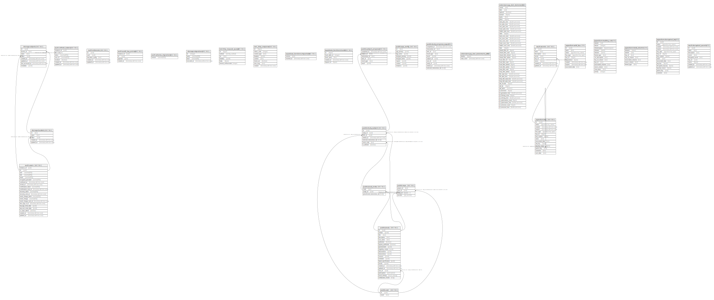

# postgres

## Tables

| Name | Columns | Comment | Type |
| ---- | ------- | ------- | ---- |
| [auth.users](auth.users.md) | 21 | Auth: Stores user login data within a secure schema. | BASE TABLE |
| [auth.refresh_tokens](auth.refresh_tokens.md) | 7 | Auth: Store of tokens used to refresh JWT tokens once they expire. | BASE TABLE |
| [auth.instances](auth.instances.md) | 5 | Auth: Manages users across multiple sites. | BASE TABLE |
| [auth.audit_log_entries](auth.audit_log_entries.md) | 4 | Auth: Audit trail for user actions. | BASE TABLE |
| [auth.schema_migrations](auth.schema_migrations.md) | 1 | Auth: Manages updates to the auth system. | BASE TABLE |
| [storage.buckets](storage.buckets.md) | 5 |  | BASE TABLE |
| [storage.objects](storage.objects.md) | 8 |  | BASE TABLE |
| [storage.migrations](storage.migrations.md) | 4 |  | BASE TABLE |
| [net.http_request_queue](net.http_request_queue.md) | 6 |  | BASE TABLE |
| [net._http_response](net._http_response.md) | 8 |  | BASE TABLE |
| [supabase_functions.migrations](supabase_functions.migrations.md) | 2 |  | BASE TABLE |
| [supabase_functions.hooks](supabase_functions.hooks.md) | 5 | Supabase Functions Hooks: Audit trail for triggered hooks. | BASE TABLE |
| [public.study](public.study.md) | 21 |  | BASE TABLE |
| [public.study_subject](public.study_subject.md) | 7 |  | BASE TABLE |
| [public.app_config](public.app_config.md) | 8 | Stores app config for different envs | BASE TABLE |
| [public.repo](public.repo.md) | 4 | Git repo where the generated project is stored | BASE TABLE |
| [public.study_invite](public.study_invite.md) | 3 | Study invite codes | BASE TABLE |
| [public.subject_progress](public.subject_progress.md) | 6 |  | BASE TABLE |
| [public.study_progress_export](public.study_progress_export.md) | 10 |  | VIEW |
| [public.user](public.user.md) | 2 | Users get automatically added, when a new user is created in auth.users | BASE TABLE |

## Stored procedures and functions

| Name | ReturnType | Arguments | Type |
| ---- | ------- | ------- | ---- |
| auth.role | text |  | FUNCTION |
| extensions.uuid_generate_v4 | uuid |  | FUNCTION |
| extensions.uuid_generate_v5 | uuid | namespace uuid, name text | FUNCTION |
| pgbouncer.get_auth | record | p_usename text | FUNCTION |
| storage.filename | text | name text | FUNCTION |
| extensions.digest | bytea | text, text | FUNCTION |
| extensions.digest | bytea | bytea, text | FUNCTION |
| extensions.hmac | bytea | text, text, text | FUNCTION |
| extensions.hmac | bytea | bytea, bytea, text | FUNCTION |
| extensions.crypt | text | text, text | FUNCTION |
| extensions.gen_salt | text | text | FUNCTION |
| extensions.gen_salt | text | text, integer | FUNCTION |
| storage.foldername | _text | name text | FUNCTION |
| storage.extension | text | name text | FUNCTION |
| extensions.encrypt | bytea | bytea, bytea, text | FUNCTION |
| extensions.decrypt | bytea | bytea, bytea, text | FUNCTION |
| extensions.encrypt_iv | bytea | bytea, bytea, bytea, text | FUNCTION |
| extensions.decrypt_iv | bytea | bytea, bytea, bytea, text | FUNCTION |
| extensions.gen_random_bytes | bytea | integer | FUNCTION |
| extensions.gen_random_uuid | uuid |  | FUNCTION |
| extensions.sign | text | payload json, secret text, algorithm text DEFAULT 'HS256'::text | FUNCTION |
| auth.uid | uuid |  | FUNCTION |
| auth.email | text |  | FUNCTION |
| storage.search | record | prefix text, bucketname text, limits integer DEFAULT 100, levels integer DEFAULT 1, offsets integer DEFAULT 0 | FUNCTION |
| extensions.uuid_nil | uuid |  | FUNCTION |
| extensions.uuid_ns_dns | uuid |  | FUNCTION |
| extensions.uuid_ns_url | uuid |  | FUNCTION |
| extensions.uuid_ns_oid | uuid |  | FUNCTION |
| extensions.uuid_ns_x500 | uuid |  | FUNCTION |
| extensions.uuid_generate_v1 | uuid |  | FUNCTION |
| extensions.uuid_generate_v1mc | uuid |  | FUNCTION |
| extensions.uuid_generate_v3 | uuid | namespace uuid, name text | FUNCTION |
| extensions.pgp_sym_encrypt | bytea | text, text | FUNCTION |
| extensions.pgp_sym_encrypt_bytea | bytea | bytea, text | FUNCTION |
| extensions.pgp_sym_encrypt | bytea | text, text, text | FUNCTION |
| extensions.pgp_sym_encrypt_bytea | bytea | bytea, text, text | FUNCTION |
| extensions.pgp_sym_decrypt | text | bytea, text | FUNCTION |
| extensions.pgp_sym_decrypt_bytea | bytea | bytea, text | FUNCTION |
| extensions.pgp_sym_decrypt | text | bytea, text, text | FUNCTION |
| extensions.pgp_sym_decrypt_bytea | bytea | bytea, text, text | FUNCTION |
| extensions.pgp_pub_encrypt | bytea | text, bytea | FUNCTION |
| extensions.pgp_pub_encrypt_bytea | bytea | bytea, bytea | FUNCTION |
| extensions.pgp_pub_encrypt | bytea | text, bytea, text | FUNCTION |
| extensions.pgp_pub_encrypt_bytea | bytea | bytea, bytea, text | FUNCTION |
| extensions.pgp_pub_decrypt | text | bytea, bytea | FUNCTION |
| extensions.pgp_pub_decrypt_bytea | bytea | bytea, bytea | FUNCTION |
| extensions.pgp_pub_decrypt | text | bytea, bytea, text | FUNCTION |
| extensions.pgp_pub_decrypt_bytea | bytea | bytea, bytea, text | FUNCTION |
| extensions.pgp_pub_decrypt | text | bytea, bytea, text, text | FUNCTION |
| extensions.pgp_pub_decrypt_bytea | bytea | bytea, bytea, text, text | FUNCTION |
| extensions.pgp_key_id | text | bytea | FUNCTION |
| extensions.armor | text | bytea | FUNCTION |
| extensions.armor | text | bytea, text[], text[] | FUNCTION |
| extensions.dearmor | bytea | text | FUNCTION |
| extensions.pgp_armor_headers | record | text, OUT key text, OUT value text | FUNCTION |
| extensions.url_encode | text | data bytea | FUNCTION |
| extensions.url_decode | bytea | data text | FUNCTION |
| extensions.algorithm_sign | text | signables text, secret text, algorithm text | FUNCTION |
| extensions.try_cast_double | float8 | inp text | FUNCTION |
| extensions.verify | record | token text, secret text, algorithm text DEFAULT 'HS256'::text | FUNCTION |
| extensions.grant_pg_cron_access | event_trigger |  | FUNCTION |
| net.check_worker_is_up | void |  | FUNCTION |
| net._await_response | bool | request_id bigint | FUNCTION |
| net._urlencode_string | text | string character varying | FUNCTION |
| net._encode_url_with_params_array | text | url text, params_array text[] | FUNCTION |
| net.http_delete | int8 | url text, params jsonb DEFAULT '{}'::jsonb, headers jsonb DEFAULT '{}'::jsonb, timeout_milliseconds integer DEFAULT 2000 | FUNCTION |
| net._http_collect_response | http_response_result | request_id bigint, async boolean DEFAULT true | FUNCTION |
| net.http_collect_response | http_response_result | request_id bigint, async boolean DEFAULT true | FUNCTION |
| supabase_functions.http_request | trigger |  | FUNCTION |
| public.active_subject_count | int4 | study study | FUNCTION |
| public.can_edit | bool | user_id uuid, study_param study | FUNCTION |
| public.get_study_from_invite | record | invite_code text | FUNCTION |
| extensions.moddatetime | trigger |  | FUNCTION |
| public.get_study_record_from_invite | study | invite_code text | FUNCTION |
| public.handle_new_user | trigger |  | FUNCTION |
| public.has_study_ended | bool | psubject_id uuid | FUNCTION |
| public.has_study_ended | bool | subject study_subject | FUNCTION |
| public.is_active_subject | bool | psubject_id uuid, days_active integer | FUNCTION |
| public.is_study_subject_of | bool | _user_id uuid, _study_id uuid | FUNCTION |
| public.last_completed_task | date | psubject_id uuid | FUNCTION |
| public.study_active_days | _int4 | study_param study | FUNCTION |
| public.study_ended_count | int4 | study study | FUNCTION |
| public.study_length | int4 | study_param study | FUNCTION |
| public.study_missed_days | _int4 | study_param study | FUNCTION |
| public.study_participant_count | int4 | study study | FUNCTION |
| public.study_total_tasks | int4 | subject study_subject | FUNCTION |
| net.http_get | int8 | url text, params jsonb DEFAULT '{}'::jsonb, headers jsonb DEFAULT '{}'::jsonb, timeout_milliseconds integer DEFAULT 2000 | FUNCTION |
| net.http_post | int8 | url text, body jsonb DEFAULT '{}'::jsonb, params jsonb DEFAULT '{}'::jsonb, headers jsonb DEFAULT '{"Content-Type": "application/json"}'::jsonb, timeout_milliseconds integer DEFAULT 2000 | FUNCTION |
| extensions.grant_pg_net_access | event_trigger |  | FUNCTION |
| public.subject_current_day | int4 | subject study_subject | FUNCTION |
| public.subject_total_active_days | int4 | subject study_subject | FUNCTION |
| public.user_email | text | user_id uuid | FUNCTION |

## Relations

---

> Generated by [tbls](https://github.com/k1LoW/tbls)
