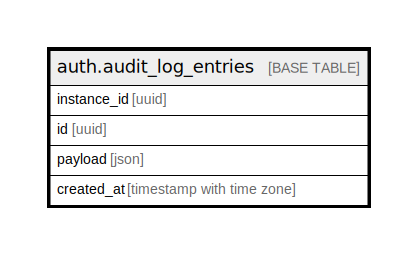

# auth.audit_log_entries

## Description

Auth: Audit trail for user actions.

## Columns

| Name | Type | Default | Nullable | Children | Parents | Comment |
| ---- | ---- | ------- | -------- | -------- | ------- | ------- |
| instance_id | uuid |  | true |  |  |  |
| id | uuid |  | false |  |  |  |
| payload | json |  | true |  |  |  |
| created_at | timestamp with time zone |  | true |  |  |  |

## Constraints

| Name | Type | Definition |
| ---- | ---- | ---------- |
| audit_log_entries_pkey | PRIMARY KEY | PRIMARY KEY (id) |

## Indexes

| Name | Definition |
| ---- | ---------- |
| audit_log_entries_pkey | CREATE UNIQUE INDEX audit_log_entries_pkey ON auth.audit_log_entries USING btree (id) |
| audit_logs_instance_id_idx | CREATE INDEX audit_logs_instance_id_idx ON auth.audit_log_entries USING btree (instance_id) |

## Relations

---

> Generated by [tbls](https://github.com/k1LoW/tbls)
