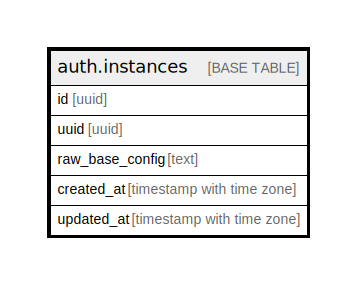

# auth.instances

## Description

Auth: Manages users across multiple sites.

## Columns

| Name | Type | Default | Nullable | Children | Parents | Comment |
| ---- | ---- | ------- | -------- | -------- | ------- | ------- |
| id | uuid |  | false |  |  |  |
| uuid | uuid |  | true |  |  |  |
| raw_base_config | text |  | true |  |  |  |
| created_at | timestamp with time zone |  | true |  |  |  |
| updated_at | timestamp with time zone |  | true |  |  |  |

## Constraints

| Name | Type | Definition |
| ---- | ---- | ---------- |
| instances_pkey | PRIMARY KEY | PRIMARY KEY (id) |

## Indexes

| Name | Definition |
| ---- | ---------- |
| instances_pkey | CREATE UNIQUE INDEX instances_pkey ON auth.instances USING btree (id) |

## Relations

---

> Generated by [tbls](https://github.com/k1LoW/tbls)
