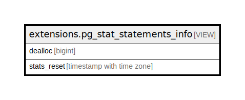

# extensions.pg_stat_statements_info

## Description

<details>
<summary><strong>Table Definition</strong></summary>

```sql
CREATE VIEW pg_stat_statements_info AS (
 SELECT pg_stat_statements_info.dealloc,
    pg_stat_statements_info.stats_reset
   FROM pg_stat_statements_info() pg_stat_statements_info(dealloc, stats_reset)
)
```

</details>

## Referenced Tables

- pg_stat_statements_info

## Columns

| Name | Type | Default | Nullable | Children | Parents | Comment |
| ---- | ---- | ------- | -------- | -------- | ------- | ------- |
| dealloc | bigint |  | true |  |  |  |
| stats_reset | timestamp with time zone |  | true |  |  |  |

## Relations



---

> Generated by [tbls](https://github.com/k1LoW/tbls)
