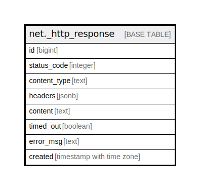

# net._http_response

## Description

## Columns

| Name | Type | Default | Nullable | Children | Parents | Comment |
| ---- | ---- | ------- | -------- | -------- | ------- | ------- |
| id | bigint |  | true |  |  |  |
| status_code | integer |  | true |  |  |  |
| content_type | text |  | true |  |  |  |
| headers | jsonb |  | true |  |  |  |
| content | text |  | true |  |  |  |
| timed_out | boolean |  | true |  |  |  |
| error_msg | text |  | true |  |  |  |
| created | timestamp with time zone | now() | false |  |  |  |

## Indexes

| Name | Definition |
| ---- | ---------- |
| _http_response_created_idx | CREATE INDEX _http_response_created_idx ON net._http_response USING btree (created) |

## Relations

---

> Generated by [tbls](https://github.com/k1LoW/tbls)
