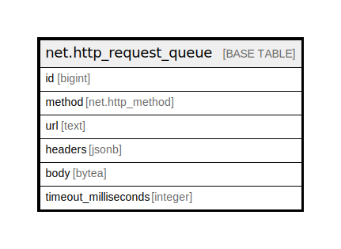

# net.http_request_queue

## Description

## Columns

| Name | Type | Default | Nullable | Children | Parents | Comment |
| ---- | ---- | ------- | -------- | -------- | ------- | ------- |
| id | bigint | nextval('net.http_request_queue_id_seq'::regclass) | false |  |  |  |
| method | net.http_method |  | false |  |  |  |
| url | text |  | false |  |  |  |
| headers | jsonb |  | false |  |  |  |
| body | bytea |  | true |  |  |  |
| timeout_milliseconds | integer |  | false |  |  |  |

## Relations

---

> Generated by [tbls](https://github.com/k1LoW/tbls)
