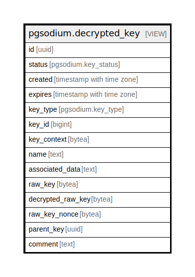

# pgsodium.decrypted_key

## Description

<details>
<summary><strong>Table Definition</strong></summary>

```sql
CREATE VIEW decrypted_key AS (
 SELECT key.id,
    key.status,
    key.created,
    key.expires,
    key.key_type,
    key.key_id,
    key.key_context,
    key.name,
    key.associated_data,
    key.raw_key,
        CASE
            WHEN (key.raw_key IS NULL) THEN NULL::bytea
            ELSE
            CASE
                WHEN (key.parent_key IS NULL) THEN NULL::bytea
                ELSE pgsodium.crypto_aead_det_decrypt(key.raw_key, convert_to(((key.id)::text || key.associated_data), 'utf8'::name), key.parent_key, key.raw_key_nonce)
            END
        END AS decrypted_raw_key,
    key.raw_key_nonce,
    key.parent_key,
    key.comment
   FROM pgsodium.key
)
```

</details>

## Referenced Tables

- [pgsodium.key](pgsodium.key.md)

## Columns

| Name | Type | Default | Nullable | Children | Parents | Comment |
| ---- | ---- | ------- | -------- | -------- | ------- | ------- |
| id | uuid |  | true |  |  |  |
| status | pgsodium.key_status |  | true |  |  |  |
| created | timestamp with time zone |  | true |  |  |  |
| expires | timestamp with time zone |  | true |  |  |  |
| key_type | pgsodium.key_type |  | true |  |  |  |
| key_id | bigint |  | true |  |  |  |
| key_context | bytea |  | true |  |  |  |
| name | text |  | true |  |  |  |
| associated_data | text |  | true |  |  |  |
| raw_key | bytea |  | true |  |  |  |
| decrypted_raw_key | bytea |  | true |  |  |  |
| raw_key_nonce | bytea |  | true |  |  |  |
| parent_key | uuid |  | true |  |  |  |
| comment | text |  | true |  |  |  |

## Relations



---

> Generated by [tbls](https://github.com/k1LoW/tbls)
