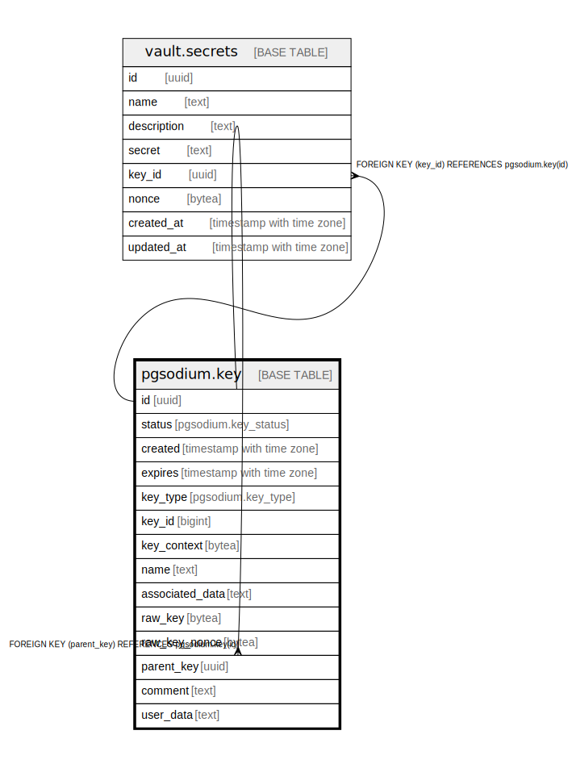

# pgsodium.key

## Description

This table holds metadata for derived keys given a key_id and key_context. The raw key is never stored.

## Columns

| Name | Type | Default | Nullable | Children | Parents | Comment |
| ---- | ---- | ------- | -------- | -------- | ------- | ------- |
| id | uuid | gen_random_uuid() | false | [pgsodium.key](pgsodium.key.md) [vault.secrets](vault.secrets.md) |  |  |
| status | pgsodium.key_status | 'valid'::pgsodium.key_status | true |  |  |  |
| created | timestamp with time zone | CURRENT_TIMESTAMP | false |  |  |  |
| expires | timestamp with time zone |  | true |  |  |  |
| key_type | pgsodium.key_type |  | true |  |  |  |
| key_id | bigint | nextval('pgsodium.key_key_id_seq'::regclass) | true |  |  |  |
| key_context | bytea | '\x7067736f6469756d'::bytea | true |  |  |  |
| name | text |  | true |  |  |  |
| associated_data | text | 'associated'::text | true |  |  |  |
| raw_key | bytea |  | true |  |  |  |
| raw_key_nonce | bytea |  | true |  |  |  |
| parent_key | uuid |  | true |  | [pgsodium.key](pgsodium.key.md) |  |
| comment | text |  | true |  |  |  |
| user_data | text |  | true |  |  |  |

## Constraints

| Name | Type | Definition |
| ---- | ---- | ---------- |
| key_key_context_check | CHECK | CHECK ((length(key_context) = 8)) |
| pgsodium_raw | CHECK | CHECK ( CASE     WHEN (raw_key IS NOT NULL) THEN ((key_id IS NULL) AND (key_context IS NULL) AND (parent_key IS NOT NULL))     ELSE ((key_id IS NOT NULL) AND (key_context IS NOT NULL) AND (parent_key IS NULL)) END) |
| key_parent_key_fkey | FOREIGN KEY | FOREIGN KEY (parent_key) REFERENCES pgsodium.key(id) |
| key_pkey | PRIMARY KEY | PRIMARY KEY (id) |
| pgsodium_key_unique_name | UNIQUE | UNIQUE (name) |

## Indexes

| Name | Definition |
| ---- | ---------- |
| key_pkey | CREATE UNIQUE INDEX key_pkey ON pgsodium.key USING btree (id) |
| key_status_idx | CREATE INDEX key_status_idx ON pgsodium.key USING btree (status) WHERE (status = ANY (ARRAY['valid'::pgsodium.key_status, 'default'::pgsodium.key_status])) |
| key_status_idx1 | CREATE UNIQUE INDEX key_status_idx1 ON pgsodium.key USING btree (status) WHERE (status = 'default'::pgsodium.key_status) |
| key_key_id_key_context_key_type_idx | CREATE UNIQUE INDEX key_key_id_key_context_key_type_idx ON pgsodium.key USING btree (key_id, key_context, key_type) |
| pgsodium_key_unique_name | CREATE UNIQUE INDEX pgsodium_key_unique_name ON pgsodium.key USING btree (name) |

## Triggers

| Name | Definition |
| ---- | ---------- |
| key_encrypt_secret_trigger_raw_key | CREATE TRIGGER key_encrypt_secret_trigger_raw_key BEFORE INSERT OR UPDATE OF raw_key ON pgsodium.key FOR EACH ROW EXECUTE FUNCTION pgsodium.key_encrypt_secret_raw_key() |

## Relations

---

> Generated by [tbls](https://github.com/k1LoW/tbls)
