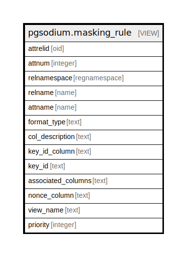

# pgsodium.masking_rule

## Description

<details>
<summary><strong>Table Definition</strong></summary>

```sql
CREATE VIEW masking_rule AS (
 WITH const AS (
         SELECT 'encrypt +with +key +id +([0-9a-f]{8}-[0-9a-f]{4}-[0-9a-f]{4}-[0-9a-f]{4}-[0-9a-f]{12})'::text AS pattern_key_id,
            'encrypt +with +key +column +([\w\"\-$]+)'::text AS pattern_key_id_column,
            '(?<=associated) +\(([\w\"\-$, ]+)\)'::text AS pattern_associated_columns,
            '(?<=nonce) +([\w\"\-$]+)'::text AS pattern_nonce_column,
            '(?<=decrypt with view) +([\w\"\-$]+\.[\w\"\-$]+)'::text AS pattern_view_name,
            '(?<=security invoker)'::text AS pattern_security_invoker
        ), rules_from_seclabels AS (
         SELECT sl.objoid AS attrelid,
            sl.objsubid AS attnum,
            (c.relnamespace)::regnamespace AS relnamespace,
            c.relname,
            a.attname,
            format_type(a.atttypid, a.atttypmod) AS format_type,
            sl.label AS col_description,
            (regexp_match(sl.label, k.pattern_key_id_column, 'i'::text))[1] AS key_id_column,
            (regexp_match(sl.label, k.pattern_key_id, 'i'::text))[1] AS key_id,
            (regexp_match(sl.label, k.pattern_associated_columns, 'i'::text))[1] AS associated_columns,
            (regexp_match(sl.label, k.pattern_nonce_column, 'i'::text))[1] AS nonce_column,
            COALESCE((regexp_match(sl2.label, k.pattern_view_name, 'i'::text))[1], (((c.relnamespace)::regnamespace || '.'::text) || quote_ident(('decrypted_'::text || (c.relname)::text)))) AS view_name,
            100 AS priority,
            ((regexp_match(sl.label, k.pattern_security_invoker, 'i'::text))[1] IS NOT NULL) AS security_invoker
           FROM const k,
            (((pg_seclabel sl
             JOIN pg_class c ON (((sl.classoid = c.tableoid) AND (sl.objoid = c.oid))))
             JOIN pg_attribute a ON (((a.attrelid = c.oid) AND (sl.objsubid = a.attnum))))
             LEFT JOIN pg_seclabel sl2 ON (((sl2.objoid = c.oid) AND (sl2.objsubid = 0))))
          WHERE ((a.attnum > 0) AND (((c.relnamespace)::regnamespace)::oid <> ('pg_catalog'::regnamespace)::oid) AND (NOT a.attisdropped) AND (sl.label ~~* 'ENCRYPT%'::text) AND (sl.provider = 'pgsodium'::text))
        )
 SELECT DISTINCT ON (rules_from_seclabels.attrelid, rules_from_seclabels.attnum) rules_from_seclabels.attrelid,
    rules_from_seclabels.attnum,
    rules_from_seclabels.relnamespace,
    rules_from_seclabels.relname,
    rules_from_seclabels.attname,
    rules_from_seclabels.format_type,
    rules_from_seclabels.col_description,
    rules_from_seclabels.key_id_column,
    rules_from_seclabels.key_id,
    rules_from_seclabels.associated_columns,
    rules_from_seclabels.nonce_column,
    rules_from_seclabels.view_name,
    rules_from_seclabels.priority,
    rules_from_seclabels.security_invoker
   FROM rules_from_seclabels
  ORDER BY rules_from_seclabels.attrelid, rules_from_seclabels.attnum, rules_from_seclabels.priority DESC
)
```

</details>

## Columns

| Name | Type | Default | Nullable | Children | Parents | Comment |
| ---- | ---- | ------- | -------- | -------- | ------- | ------- |
| attrelid | oid |  | true |  |  |  |
| attnum | integer |  | true |  |  |  |
| relnamespace | regnamespace |  | true |  |  |  |
| relname | name |  | true |  |  |  |
| attname | name |  | true |  |  |  |
| format_type | text |  | true |  |  |  |
| col_description | text |  | true |  |  |  |
| key_id_column | text |  | true |  |  |  |
| key_id | text |  | true |  |  |  |
| associated_columns | text |  | true |  |  |  |
| nonce_column | text |  | true |  |  |  |
| view_name | text |  | true |  |  |  |
| priority | integer |  | true |  |  |  |
| security_invoker | boolean |  | true |  |  |  |

## Relations



---

> Generated by [tbls](https://github.com/k1LoW/tbls)
