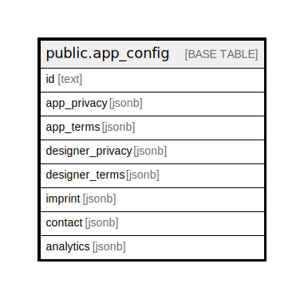

# public.app_config

## Description

Stores app config for different envs

## Columns

| Name | Type | Default | Nullable | Children | Parents | Comment |
| ---- | ---- | ------- | -------- | -------- | ------- | ------- |
| id | text |  | false |  |  |  |
| app_min_version | text | '0.0.0'::text | false |  |  |  |
| app_playstore_url | text | 'https://play.google.com/store/apps/details?id=health.studyu.app'::text | false |  |  |  |
| app_appstore_url | text | 'https://itunes.apple.com/app/id1571991198'::text | false |  |  |  |
| app_privacy | jsonb |  | false |  |  |  |
| app_terms | jsonb |  | false |  |  |  |
| designer_privacy | jsonb |  | false |  |  |  |
| designer_terms | jsonb |  | false |  |  |  |
| imprint | jsonb |  | false |  |  |  |
| contact | jsonb | '{"email": "hpi-info@hpi.de", "phone": "+49-(0)331 5509-0", "website": "https://hpi.de/", "organization": "Hasso Plattner Institute"}'::jsonb | false |  |  |  |
| analytics | jsonb |  | true |  |  |  |

## Constraints

| Name | Type | Definition |
| ---- | ---- | ---------- |
| AppConfig_pkey | PRIMARY KEY | PRIMARY KEY (id) |

## Indexes

| Name | Definition |
| ---- | ---------- |
| AppConfig_pkey | CREATE UNIQUE INDEX "AppConfig_pkey" ON public.app_config USING btree (id) |

## Relations

---

> Generated by [tbls](https://github.com/k1LoW/tbls)
