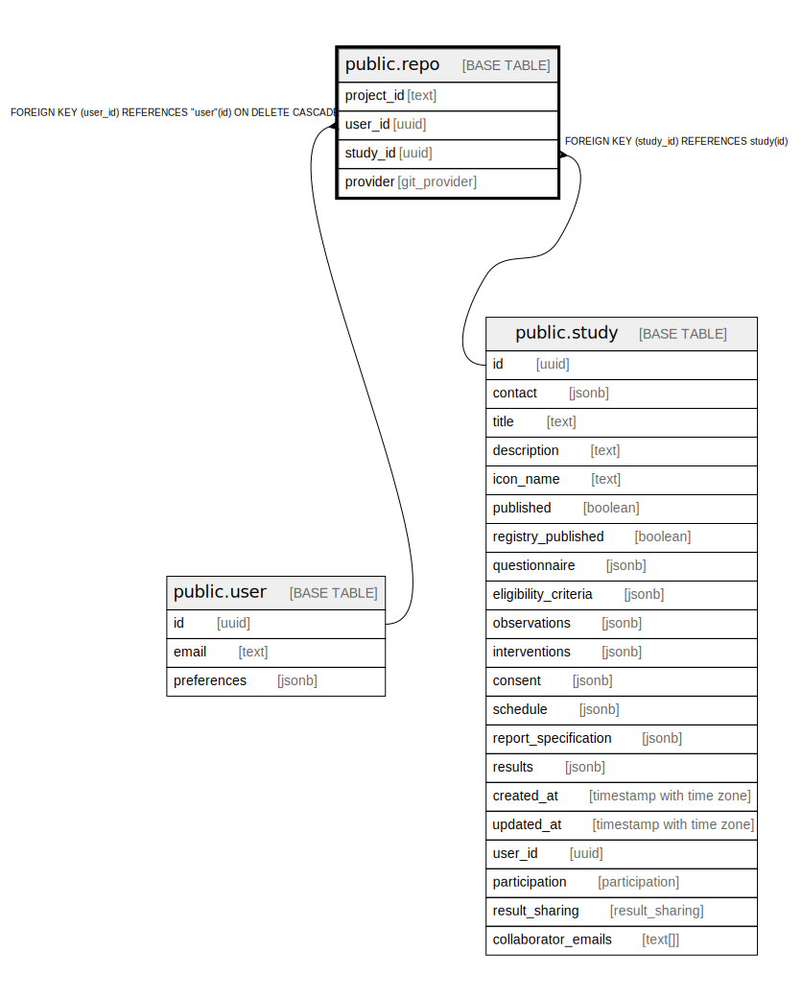

# public.repo

## Description

Git repo where the generated project is stored

## Columns

| Name | Type | Default | Nullable | Children | Parents | Comment |
| ---- | ---- | ------- | -------- | -------- | ------- | ------- |
| project_id | text |  | false |  |  |  |
| user_id | uuid |  | false |  | [public.user](public.user.md) |  |
| study_id | uuid |  | false |  | [public.study](public.study.md) |  |
| provider | git_provider |  | false |  |  |  |

## Constraints

| Name | Type | Definition |
| ---- | ---- | ---------- |
| repo_pkey | PRIMARY KEY | PRIMARY KEY (project_id) |
| repo_studyId_fkey | FOREIGN KEY | FOREIGN KEY (study_id) REFERENCES study(id) |
| repo_userId_fkey | FOREIGN KEY | FOREIGN KEY (user_id) REFERENCES "user"(id) ON DELETE CASCADE |

## Indexes

| Name | Definition |
| ---- | ---------- |
| repo_pkey | CREATE UNIQUE INDEX repo_pkey ON public.repo USING btree (project_id) |

## Relations

---

> Generated by [tbls](https://github.com/k1LoW/tbls)
