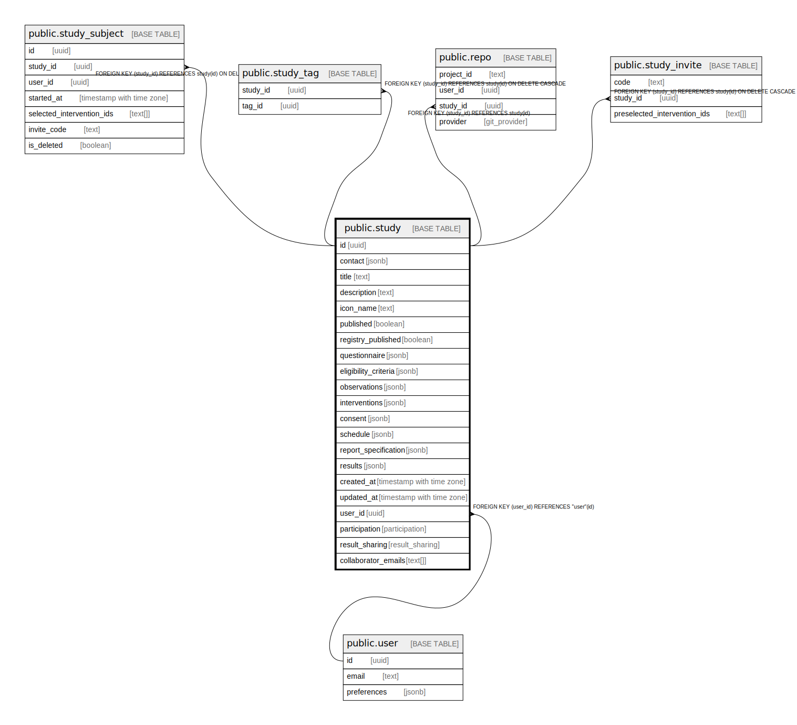

# public.study

## Description

## Columns

| Name | Type | Default | Nullable | Children | Parents | Comment |
| ---- | ---- | ------- | -------- | -------- | ------- | ------- |
| id | uuid | gen_random_uuid() | false | [public.study](public.study.md) [public.study_subject](public.study_subject.md) [public.repo](public.repo.md) [public.study_invite](public.study_invite.md) |  |  |
| parent_template_id | uuid |  | true |  | [public.study](public.study.md) |  |
| template_configuration | jsonb |  | true |  |  |  |
| contact | jsonb |  | false |  |  |  |
| title | text |  | false |  |  |  |
| description | text |  | false |  |  |  |
| icon_name | text |  | false |  |  |  |
| published | boolean | false | false |  |  |  |
| registry_published | boolean | false | false |  |  |  |
| questionnaire | jsonb |  | false |  |  |  |
| eligibility_criteria | jsonb |  | false |  |  |  |
| observations | jsonb |  | false |  |  |  |
| interventions | jsonb |  | false |  |  |  |
| consent | jsonb |  | false |  |  |  |
| schedule | jsonb |  | false |  |  |  |
| report_specification | jsonb |  | false |  |  |  |
| results | jsonb |  | false |  |  |  |
| created_at | timestamp with time zone | now() | false |  |  |  |
| updated_at | timestamp with time zone | now() | false |  |  |  |
| user_id | uuid |  | false |  | [public.user](public.user.md) | UserId of study creator |
| participation | participation | 'invite'::participation | false |  |  |  |
| result_sharing | result_sharing | 'private'::result_sharing | false |  |  |  |
| collaborator_emails | text[] | '{}'::text[] | false |  |  |  |

## Constraints

| Name | Type | Definition |
| ---- | ---- | ---------- |
| study_id_key | UNIQUE | UNIQUE (id) |
| study_parent_template_id_fkey | FOREIGN KEY | FOREIGN KEY (parent_template_id) REFERENCES study(id) |
| study_pkey | PRIMARY KEY | PRIMARY KEY (id) |
| study_userId_fkey | FOREIGN KEY | FOREIGN KEY (user_id) REFERENCES "user"(id) |

## Indexes

| Name | Definition |
| ---- | ---------- |
| study_id_key | CREATE UNIQUE INDEX study_id_key ON public.study USING btree (id) |
| study_pkey | CREATE UNIQUE INDEX study_pkey ON public.study USING btree (id) |

## Triggers

| Name | Definition |
| ---- | ---------- |
| handle_updated_at | CREATE TRIGGER handle_updated_at BEFORE UPDATE ON public.study FOR EACH ROW EXECUTE FUNCTION moddatetime('updated_at') |

## Relations

---

> Generated by [tbls](https://github.com/k1LoW/tbls)
