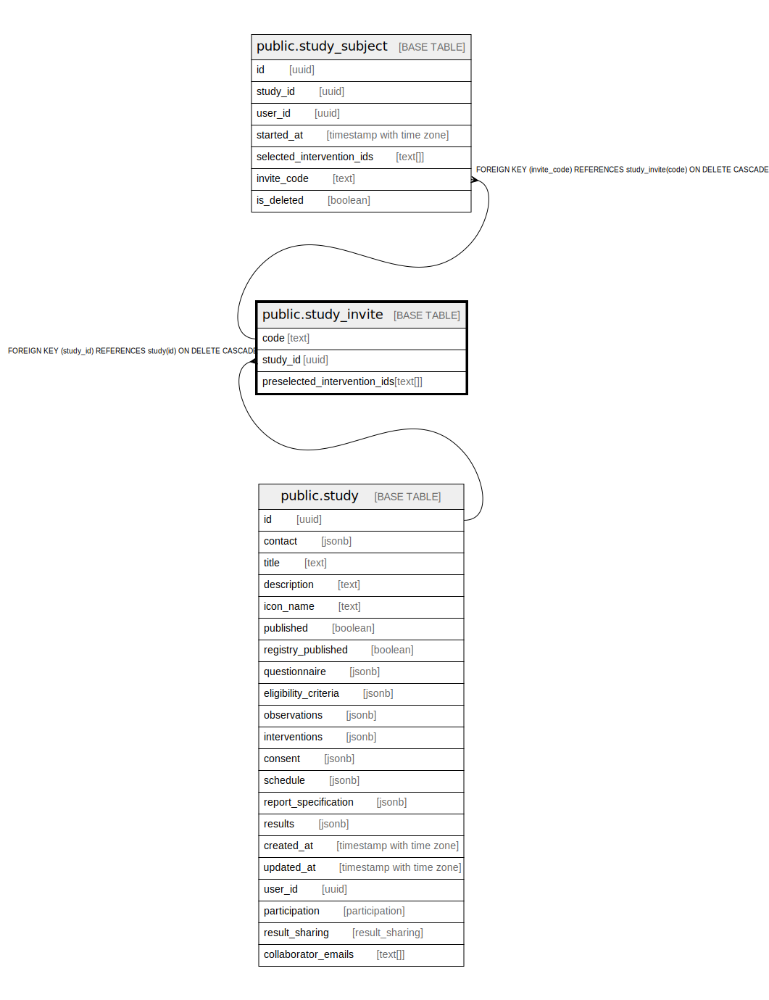

# public.study_invite

## Description

Study invite codes

## Columns

| Name | Type | Default | Nullable | Children | Parents | Comment |
| ---- | ---- | ------- | -------- | -------- | ------- | ------- |
| code | text |  | false | [public.study_subject](public.study_subject.md) |  |  |
| study_id | uuid |  | false |  | [public.study](public.study.md) |  |
| preselected_intervention_ids | text[] |  | true |  |  | Intervention Ids (and order) preselected by study creator |

## Constraints

| Name | Type | Definition |
| ---- | ---- | ---------- |
| study_invite_studyId_fkey | FOREIGN KEY | FOREIGN KEY (study_id) REFERENCES study(id) ON DELETE CASCADE |
| study_invite_pkey | PRIMARY KEY | PRIMARY KEY (code) |

## Indexes

| Name | Definition |
| ---- | ---------- |
| study_invite_pkey | CREATE UNIQUE INDEX study_invite_pkey ON public.study_invite USING btree (code) |

## Relations

---

> Generated by [tbls](https://github.com/k1LoW/tbls)
