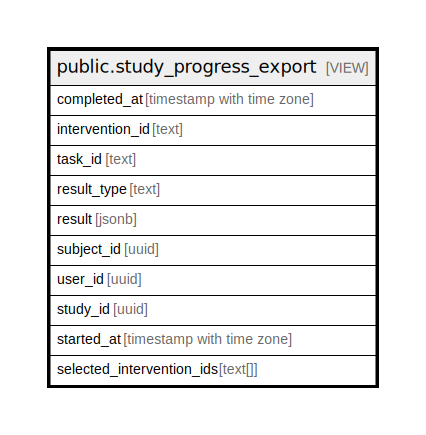

# public.study_progress_export

## Description

<details>
<summary><strong>Table Definition</strong></summary>

```sql
CREATE VIEW study_progress_export AS (
 SELECT subject_progress.completed_at,
    subject_progress.intervention_id,
    subject_progress.task_id,
    subject_progress.result_type,
    subject_progress.result,
    subject_progress.subject_id,
    study_subject.user_id,
    study_subject.study_id,
    study_subject.started_at,
    study_subject.selected_intervention_ids
   FROM study_subject,
    subject_progress
  WHERE (study_subject.id = subject_progress.subject_id)
)
```

</details>

## Referenced Tables

- [public.study_subject](public.study_subject.md)

## Columns

| Name | Type | Default | Nullable | Children | Parents | Comment |
| ---- | ---- | ------- | -------- | -------- | ------- | ------- |
| completed_at | timestamp with time zone |  | true |  |  |  |
| intervention_id | text |  | true |  |  |  |
| task_id | text |  | true |  |  |  |
| result_type | text |  | true |  |  |  |
| result | jsonb |  | true |  |  |  |
| subject_id | uuid |  | true |  |  |  |
| user_id | uuid |  | true |  |  |  |
| study_id | uuid |  | true |  |  |  |
| started_at | timestamp with time zone |  | true |  |  |  |
| selected_intervention_ids | text[] |  | true |  |  |  |

## Relations



---

> Generated by [tbls](https://github.com/k1LoW/tbls)
