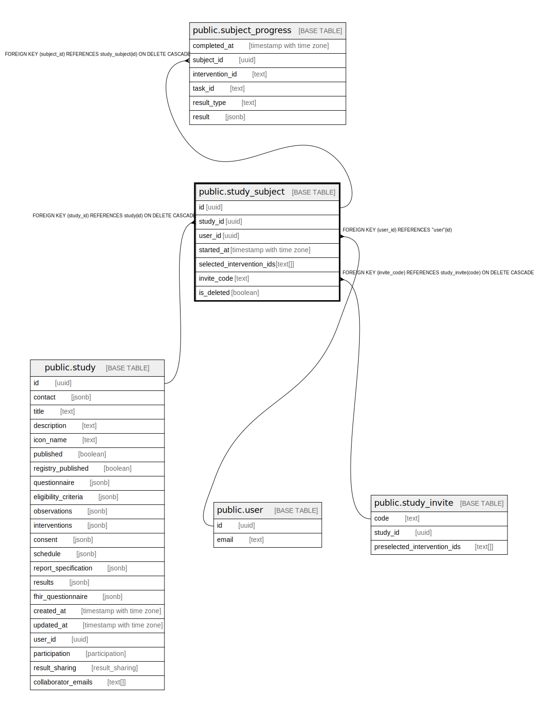

# public.study_subject

## Description

## Columns

| Name | Type | Default | Nullable | Children | Parents | Comment |
| ---- | ---- | ------- | -------- | -------- | ------- | ------- |
| id | uuid | gen_random_uuid() | false | [public.subject_progress](public.subject_progress.md) |  |  |
| study_id | uuid |  | false |  | [public.study](public.study.md) |  |
| user_id | uuid |  | false |  | [public.user](public.user.md) |  |
| started_at | timestamp with time zone | now() | true |  |  |  |
| selected_intervention_ids | text[] |  | false |  |  |  |
| invite_code | text |  | true |  | [public.study_invite](public.study_invite.md) |  |
| is_deleted | boolean | false | false |  |  |  |

## Constraints

| Name | Type | Definition |
| ---- | ---- | ---------- |
| study_subject_loginCode_fkey | FOREIGN KEY | FOREIGN KEY (invite_code) REFERENCES study_invite(code) ON DELETE CASCADE |
| study_subject_studyId_fkey | FOREIGN KEY | FOREIGN KEY (study_id) REFERENCES study(id) ON DELETE CASCADE |
| study_subject_pkey | PRIMARY KEY | PRIMARY KEY (id) |
| study_subject_userId_fkey | FOREIGN KEY | FOREIGN KEY (user_id) REFERENCES "user"(id) |

## Indexes

| Name | Definition |
| ---- | ---------- |
| study_subject_pkey | CREATE UNIQUE INDEX study_subject_pkey ON public.study_subject USING btree (id) |

## Relations

---

> Generated by [tbls](https://github.com/k1LoW/tbls)
