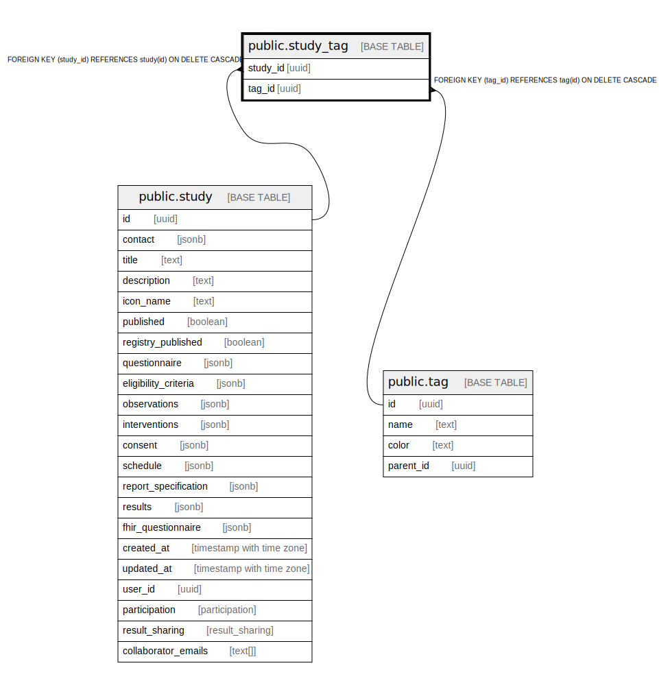

# public.study_tag

## Description

## Columns

| Name | Type | Default | Nullable | Children | Parents | Comment |
| ---- | ---- | ------- | -------- | -------- | ------- | ------- |
| study_id | uuid |  | false |  | [public.study](public.study.md) |  |
| tag_id | uuid |  | false |  | [public.tag](public.tag.md) |  |

## Constraints

| Name | Type | Definition |
| ---- | ---- | ---------- |
| study_tag_studyId_fkey | FOREIGN KEY | FOREIGN KEY (study_id) REFERENCES study(id) ON DELETE CASCADE |
| study_tag_tagId_fkey | FOREIGN KEY | FOREIGN KEY (tag_id) REFERENCES tag(id) ON DELETE CASCADE |
| study_tag_pkey | PRIMARY KEY | PRIMARY KEY (study_id, tag_id) |

## Indexes

| Name | Definition |
| ---- | ---------- |
| study_tag_pkey | CREATE UNIQUE INDEX study_tag_pkey ON public.study_tag USING btree (study_id, tag_id) |

## Relations

---

> Generated by [tbls](https://github.com/k1LoW/tbls)
