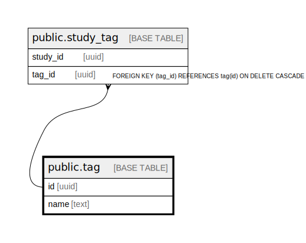

# public.tag

## Description

## Columns

| Name | Type | Default | Nullable | Children | Parents | Comment |
| ---- | ---- | ------- | -------- | -------- | ------- | ------- |
| id | uuid | gen_random_uuid() | false | [public.tag](public.tag.md) [public.study_tag](public.study_tag.md) |  |  |
| name | text |  | false |  |  |  |
| color | text |  | true |  |  |  |
| parent_id | uuid |  | true |  | [public.tag](public.tag.md) |  |

## Constraints

| Name | Type | Definition |
| ---- | ---- | ---------- |
| tag_parentId_fkey | FOREIGN KEY | FOREIGN KEY (parent_id) REFERENCES tag(id) ON DELETE CASCADE |
| tag_pkey | PRIMARY KEY | PRIMARY KEY (id) |

## Indexes

| Name | Definition |
| ---- | ---------- |
| tag_pkey | CREATE UNIQUE INDEX tag_pkey ON public.tag USING btree (id) |

## Relations

---

> Generated by [tbls](https://github.com/k1LoW/tbls)
