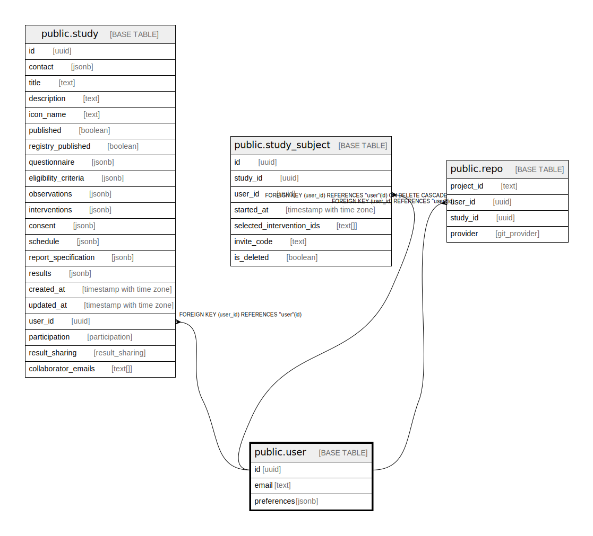

# public.user

## Description

Users get automatically added, when a new user is created in auth.users

## Columns

| Name | Type | Default | Nullable | Children | Parents | Comment |
| ---- | ---- | ------- | -------- | -------- | ------- | ------- |
| id | uuid |  | false | [public.study](public.study.md) [public.study_subject](public.study_subject.md) [public.repo](public.repo.md) |  |  |
| email | text |  | true |  |  |  |
| preferences | jsonb |  | true |  |  |  |

## Constraints

| Name | Type | Definition |
| ---- | ---- | ---------- |
| user_pkey | PRIMARY KEY | PRIMARY KEY (id) |

## Indexes

| Name | Definition |
| ---- | ---------- |
| user_pkey | CREATE UNIQUE INDEX user_pkey ON public."user" USING btree (id) |

## Relations

---

> Generated by [tbls](https://github.com/k1LoW/tbls)
