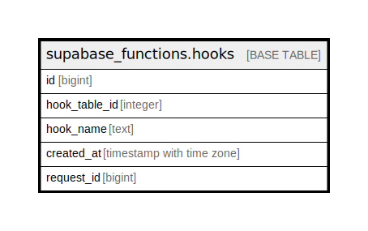

# supabase_functions.hooks

## Description

Supabase Functions Hooks: Audit trail for triggered hooks.

## Columns

| Name | Type | Default | Nullable | Children | Parents | Comment |
| ---- | ---- | ------- | -------- | -------- | ------- | ------- |
| id | bigint | nextval('supabase_functions.hooks_id_seq'::regclass) | false |  |  |  |
| hook_table_id | integer |  | false |  |  |  |
| hook_name | text |  | false |  |  |  |
| created_at | timestamp with time zone | now() | false |  |  |  |
| request_id | bigint |  | true |  |  |  |

## Constraints

| Name | Type | Definition |
| ---- | ---- | ---------- |
| hooks_pkey | PRIMARY KEY | PRIMARY KEY (id) |

## Indexes

| Name | Definition |
| ---- | ---------- |
| hooks_pkey | CREATE UNIQUE INDEX hooks_pkey ON supabase_functions.hooks USING btree (id) |
| supabase_functions_hooks_request_id_idx | CREATE INDEX supabase_functions_hooks_request_id_idx ON supabase_functions.hooks USING btree (request_id) |
| supabase_functions_hooks_h_table_id_h_name_idx | CREATE INDEX supabase_functions_hooks_h_table_id_h_name_idx ON supabase_functions.hooks USING btree (hook_table_id, hook_name) |

## Relations

---

> Generated by [tbls](https://github.com/k1LoW/tbls)
