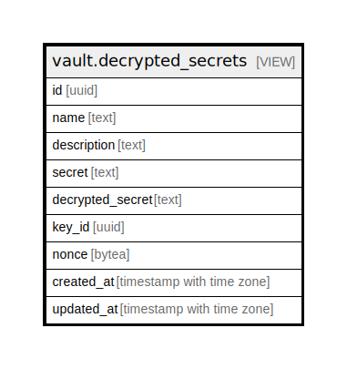

# vault.decrypted_secrets

## Description

<details>
<summary><strong>Table Definition</strong></summary>

```sql
CREATE VIEW decrypted_secrets AS (
 SELECT secrets.id,
    secrets.name,
    secrets.description,
    secrets.secret,
        CASE
            WHEN (secrets.secret IS NULL) THEN NULL::text
            ELSE
            CASE
                WHEN (secrets.key_id IS NULL) THEN NULL::text
                ELSE convert_from(pgsodium.crypto_aead_det_decrypt(decode(secrets.secret, 'base64'::text), convert_to(((((secrets.id)::text || secrets.description) || (secrets.created_at)::text) || (secrets.updated_at)::text), 'utf8'::name), secrets.key_id, secrets.nonce), 'utf8'::name)
            END
        END AS decrypted_secret,
    secrets.key_id,
    secrets.nonce,
    secrets.created_at,
    secrets.updated_at
   FROM vault.secrets
)
```

</details>

## Referenced Tables

- [vault.secrets](vault.secrets.md)

## Columns

| Name | Type | Default | Nullable | Children | Parents | Comment |
| ---- | ---- | ------- | -------- | -------- | ------- | ------- |
| id | uuid |  | true |  |  |  |
| name | text |  | true |  |  |  |
| description | text |  | true |  |  |  |
| secret | text |  | true |  |  |  |
| decrypted_secret | text |  | true |  |  |  |
| key_id | uuid |  | true |  |  |  |
| nonce | bytea |  | true |  |  |  |
| created_at | timestamp with time zone |  | true |  |  |  |
| updated_at | timestamp with time zone |  | true |  |  |  |

## Relations



---

> Generated by [tbls](https://github.com/k1LoW/tbls)
