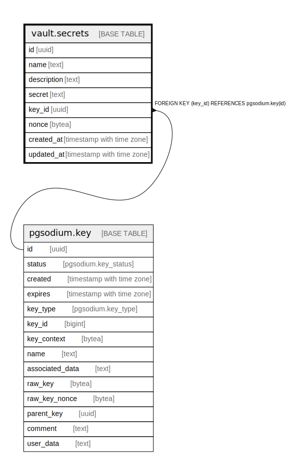

# vault.secrets

## Description

Table with encrypted `secret` column for storing sensitive information on disk.

## Columns

| Name | Type | Default | Nullable | Children | Parents | Comment |
| ---- | ---- | ------- | -------- | -------- | ------- | ------- |
| id | uuid | gen_random_uuid() | false |  |  |  |
| name | text |  | true |  |  |  |
| description | text | ''::text | false |  |  |  |
| secret | text |  | false |  |  |  |
| key_id | uuid | (pgsodium.create_key()).id | true |  | [pgsodium.key](pgsodium.key.md) |  |
| nonce | bytea | pgsodium.crypto_aead_det_noncegen() | true |  |  |  |
| created_at | timestamp with time zone | CURRENT_TIMESTAMP | false |  |  |  |
| updated_at | timestamp with time zone | CURRENT_TIMESTAMP | false |  |  |  |

## Constraints

| Name | Type | Definition |
| ---- | ---- | ---------- |
| secrets_key_id_fkey | FOREIGN KEY | FOREIGN KEY (key_id) REFERENCES pgsodium.key(id) |
| secrets_pkey | PRIMARY KEY | PRIMARY KEY (id) |

## Indexes

| Name | Definition |
| ---- | ---------- |
| secrets_pkey | CREATE UNIQUE INDEX secrets_pkey ON vault.secrets USING btree (id) |
| secrets_name_idx | CREATE UNIQUE INDEX secrets_name_idx ON vault.secrets USING btree (name) WHERE (name IS NOT NULL) |

## Triggers

| Name | Definition |
| ---- | ---------- |
| secrets_encrypt_secret_trigger_secret | CREATE TRIGGER secrets_encrypt_secret_trigger_secret BEFORE INSERT OR UPDATE OF secret ON vault.secrets FOR EACH ROW EXECUTE FUNCTION vault.secrets_encrypt_secret_secret() |

## Relations

---

> Generated by [tbls](https://github.com/k1LoW/tbls)
